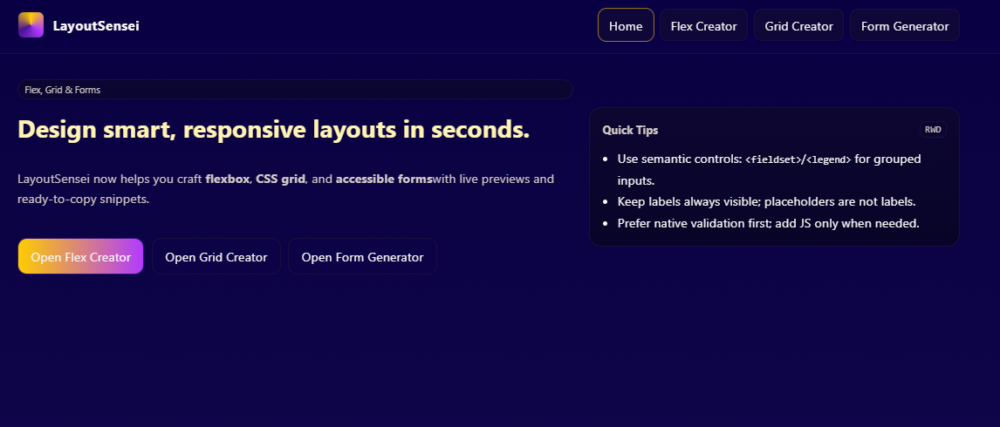
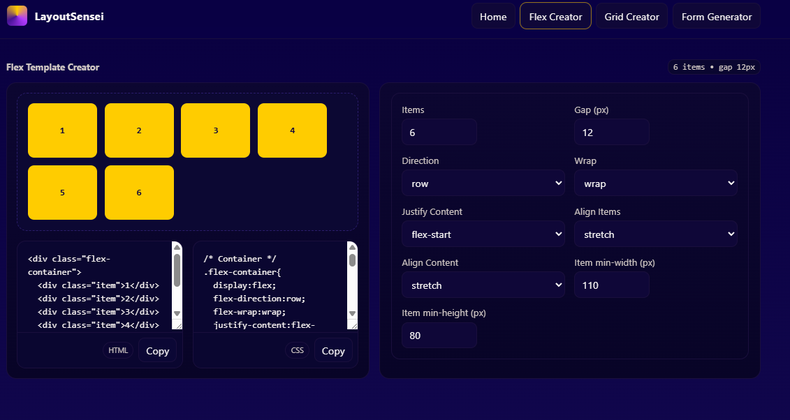
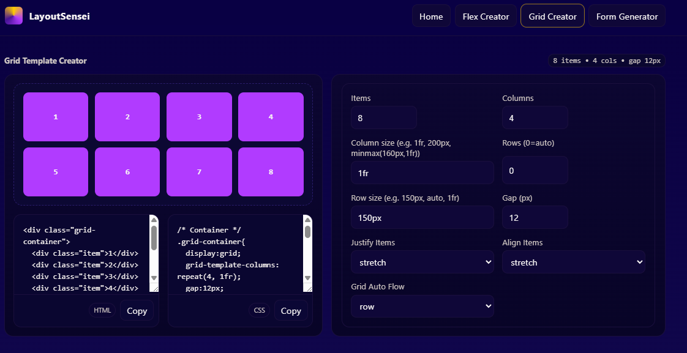
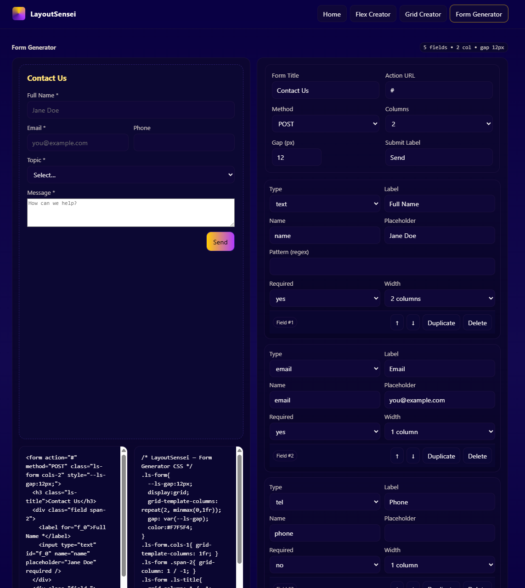

# LayoutSensei

_A friendly CSS Grid, Flexbox, and Form layout generator built with React + Vite._


---

## ✨ What it does

LayoutSensei helps developers and designers rapidly prototype page structures:

- **Grid Builder** — define columns/rows, gaps, and named areas; preview responsive behavior.
- **Flex Builder** — tweak direction/wrap/justify/align and copy the snippet.
- **Form Builder (planned)** — assemble inputs, selects, checkboxes, validation hints, and ARIA labels, then export clean HTML/CSS.

> **Status:** project scaffolded; core builders in progress. See roadmap below.

---

## 🎥 Demo

_Coming soon._ (Add your deployed link here when ready.)

---

## 🧰 Tech Stack

- **Frontend:** React + Vite
- **Languages:** JavaScript, CSS, HTML
- **Linting:** ESLint (repo includes config)

---

## 🚀 Quick Start

```bash
# 1) Clone
git clone https://github.com/YoItsLuisBro/layoutsensei.git
cd layoutsensei

# 2) Install deps
npm install

# 3) Run dev server
npm run dev

# 4) Build & preview
npm run build
npm run preview
```

## 🗂️ Project Structure

```php
layoutsensei/
├─ public/                  # static assets
├─ src/
│  ├─ components/           # UI building blocks
│  ├─ hooks/                # reusable logic (state, clipboard, etc.)
│  ├─ pages/                # route-level views (Grid, Flex, Forms)
│  ├─ styles/               # global and utility CSS
│  ├─ App.jsx               # app shell + routes
│  └─ main.jsx              # app entry
├─ index.html
├─ package.json
└─ vite.config.js
```

## 🕹️ How to Use (intended UX)

1. Choose Grid or Flex builder.

2. Adjust parameters (columns/rows, gaps, alignments, etc.).

3. Toggle breakpoints to preview responsiveness.

4. Click Copy to grab HTML + CSS (or download as a snippet).

5. (Planned) Save/load presets as JSON.

### Sample export (grid)

```html
<section class="grid">
  <header class="a">Header</header>
  <nav class="b">Nav</nav>
  <main class="c">Content</main>
  <aside class="d">Aside</aside>
  <footer class="e">Footer</footer>
</section>
```
```css
.grid {
  display: grid;
  grid-template-columns: 1fr 2fr;
  grid-template-rows: auto 1fr auto;
  gap: 12px;
  grid-template-areas:
    "a a"
    "b c"
    "d e";
}
.a { grid-area: a; }
.b { grid-area: b; }
.c { grid-area: c; }
.d { grid-area: d; }
.e { grid-area: e; }
```

## 🗺️ Roadmap

- [ ] React + Vite scaffold

- [ ] Grid builder MVP (areas, repeat(), gap)

- [ ] Flex builder MVP (direction, wrap, justify, align, gap)

- [ ] Breakpoint presets (sm/md/lg) with live preview

- [ ] Copy/Download snippet (HTML/CSS/JSON)

- [ ] Form builder (drag-and-drop fields, validation, ARIA)

- [ ] Dark mode + theme tokens

- [ ] Shareable permalink for saved layouts

## 🧪 Development Notes

- Keep components pure and state colocated; lift only when necessary.

- Favor CSS logical properties and clamp()/minmax() for responsiveness.

- Accessibility matters: keyboard focus, ARIA labels, and color contrast.

## 👤 Author

- Luis Fonseca
- GitHub: @YoItsLuisBro

## 📸 Screenshots






